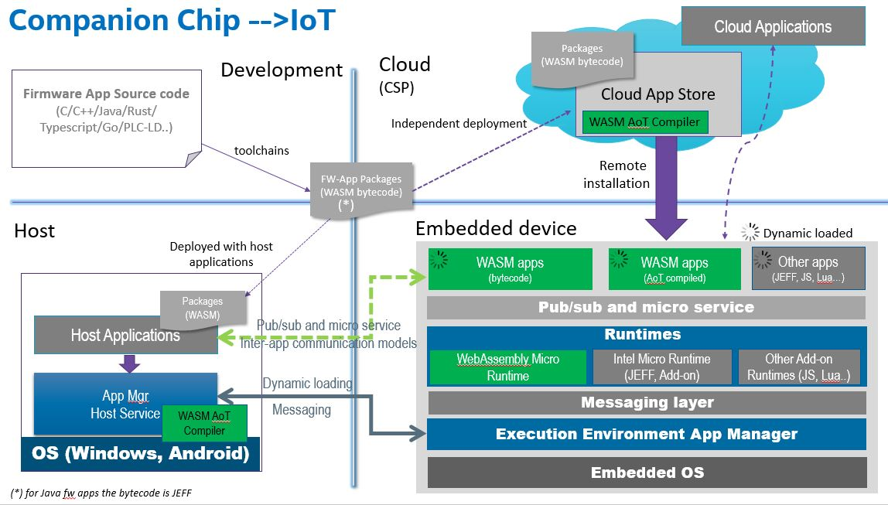
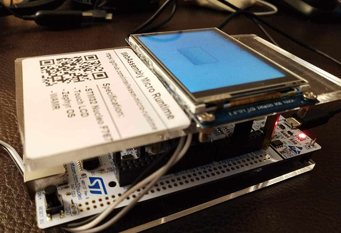

WebAssembly Micro Runtime
=========================

**A [Bytecode Alliance][BA] project**

[BA]: https://bytecodealliance.org/

WebAssembly Micro Runtime (WAMR) is a standalone WebAssembly (WASM) runtime with small footprint. It includes a few parts as below:
- A WebAssembly VM core (namely iwasm)
- The supporting API's for the WASM applications
- A mechanism for dynamic management of the WASM application

Current Features of WAMR
=========================
- WASM interpreter (AOT is planned)
- Provides embedding C API
- Provides a mechanism for exporting native API's to WASM applications
- Supports libc for WASM applications in two modes: the built-in libc subset for embedded environment and [WASI](https://github.com/WebAssembly/WASI) for standard libc
- The WASM application framework and purely asynchronized programming model
- Supports for micro-service and pub-sub event inter-app communication models
- Supports remote WASM application management from either host or cloud
- Menu configuration for easy platform integration

Application framework architecture
===================================

By using the iwasm VM core, we are flexible to build different application frameworks for the specific domains. 

The WAMR has offered a comprehensive application framework for device and IoT usages. The framework solves many common requirements for building a real project:
- Modular design for more language runtimes support
- Inter application communication
- Remote application management
- WASM APP programming model and API extension mechanism 

Build WAMR 
==========

###Build WAMR VM Core 

WAMR VM core (iwasm) can support building for different target platforms:
- Linux
- Zephyr
- Mac
- VxWorks
- AliOS-Things
- Intel Software Guard Extention (SGX)

See the [doc/building_wamr.md](./doc/building_wamr.md) for the detailed instructions.

###libc building options

WAMR supports WASI for standard libc library as well as a [built-in libc subset](./doc/wamr_api.md) for tiny footprint. 

WASI is supported on following platforms and enabled by default build:
- Linux

###Embed WAMR 

WAMR can be built into a standalone executable which takes the WASM application file name as input, and then executes it. In some other situations, the WAMR source code is embedded the product code and built into the final product. 

WAMR provides a set of C API for loading the WASM module, instantiating the module and invoking a WASM function from a native call. 

See the [doc/embed_wamr.md](./doc/embed_wamr.md) for the details.

###Build  WAMR with customized application library
The WAMR provides an application framework and assoicated API sets. The  

WAMR application programming library
===================================

WAMR defined event driven programming model:
- Single thread per WASM app instance
- App must implement system callbacks: on_init, on_destroy

In general there are a few API classes for the WASM application programming:
- WAMR Built-in API: WAMR core provides a minimal libc API set for WASM APP
- WAMR application libraries: 
  - Timer
  - Micro service (Request/Response)
  - Pub/Sub
  - Sensor
  - Connection and data transmission
  - 2D graphic UI (based on littlevgl)
- User extended native API: extend the native API to the WASM applications
- 3rd party libraries: Programmers can download any 3rd party C/C++ source code and build it together with the WASM APP code

See the [doc/wamr_api.md](./doc/wamr_api.md) for the details.

Samples and demos
=================

The WAMR samples are located in folder [./samples](./samples). A sample usually contains the WAMR runtime build, WASM applications and test tools. The WARM provides following samples:
- [Simple](./samples/simple/README.md): The runtime is integrated with most of the WAMR APP libaries and multiple WASM applications are provided for using different WASM API set.
- [littlevgl](./samples/littlevgl/README.md): Demostrating the graphic user interface application usage on WAMR. The whole [LittlevGL](https://github.com/littlevgl/) 2D user graphic library and the UI application is built into WASM application.  
- [gui](./samples/gui/README.md): Moved the [LittlevGL](https://github.com/littlevgl/) library into the runtime and defined a WASM application interface by wrapping the littlevgl API.
- [IoT-APP-Store-Demo](./test-tools/IoT-APP-Store-Demo/README.md): A web site for demostrating a WASM APP store usage where we can remotely install and uninstall WASM application on remote devices.

The graphic user interface demo photo:

Releases and acknowledgments
============================

WAMR is a community efforts. Since Intel Corp contributed the first release of this open source project, this project has received many good contributions from the community. 

See the [major features releasing history and contributor names](./doc/release_ack.md)   

Roadmap
=======

See the [roadmap](./doc/roadmap.md) to understand what major features are planned or under development.

Please submit issues for any new feature request, or your plan for contributing new features.

License
=======
WAMR uses the same license as LLVM: the `Apache 2.0 license` with the LLVM
exception. See the LICENSE file for details. This license allows you to freely
use, modify, distribute and sell your own products based on WAMR.
Any contributions you make will be under the same license.

Submit issues and contact the maintainers
=========================================
[Click here to submit. Your feedback is always welcome!](https://github.com/intel/wasm-micro-runtime/issues/new)

Contact the maintainers: imrt-public@intel.com
