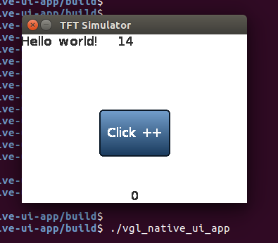

Introduction
==============
This sample demonstrates that a graphic user interface application in WebAssembly programming with WAMR graphic library(WGL), which is implemented based on LittlevGL, an open-source embedded 2d graphic library.

In this sample, the whole LittlevGL source code is built into the WAMR runtime. And WGL provides a group of WebAssembly wrapper API's for user to write graphic application. These API's is listed in: `<wamr_root>/core/iwasm/lib/app-libs/extension/gui/wgl.h`. Currently only a few API's are provided and there will be more.

The runtime component supports building target for Linux and Zephyr/STM Nucleo board. The beauty of this sample is the WebAssembly application can have identical display and behavior when running from both runtime environments. That implies we can do majority of application validation from desktop environment as long as two runtime distributions support the same set of application interface.

The sample also provides the native Linux version of application without the runtime under folder "vgl-native-ui-app". It can help to check differences between the implementations in native and WebAssembly.

 


The number on top will plus one each second, and the number on the bottom will plus one when clicked.

Install required SDK and libraries
==============
- 32 bit SDL(simple directmedia layer)
Use apt-get</br>
    `sudo apt-get install libsdl2-dev:i386`</br>
Or download source from www.libsdl.org</br>
    `./configure C_FLAGS=-m32 CXX_FLAGS=-m32 LD_FLAGS=-m32`</br>
    `make`</br>
    `sudo make install`</br>
- Install EMSDK
<pre>
    https://emscripten.org/docs/tools_reference/emsdk.html
</pre>

Build and Run
==============

Linux
--------------------------------
- Build</br>
`./build.sh`</br>
    All binaries are in "out", which contains "host_tool", "vgl_native_ui_app", "TestApplet1.wasm" and "vgl_wasm_runtime".
- Run native Linux application</br>
`./vgl_native_ui_app`</br>

- Run WASM VM Linux applicaton & install WASM APP</br>
 First start vgl_wasm_runtime in server mode.</br>
`./vgl_wasm_runtime -s`</br>
 Then install wasm APP use host tool.</br>
`./host_tool -i ui_app -f ui_app.wasm`</br>

Zephyr
--------------------------------
WASM VM and native extension method can be built into Zephyr, Then we can install wasm app into STM32.</br>
- Build WASM VM into Zephyr system</br>
 a. clone zephyr source code</br>
Refer to Zephyr getting started.</br>
https://docs.zephyrproject.org/latest/getting_started/index.html</br>
`west init zephyrproject`</br>
`cd zephyrproject`</br>
`west update`</br>
 b. copy samples</br>
    `cd zephyr/samples/`</br>
    `cp -a <wamr_root>samples/littlevgl/vgl-wasm-runtime vgl-wasm-runtime`</br>
    `cd vgl-wasm-runtime/zephyr_build`</br>
 c. create a link to wamr core</br>
   ` ln -s <wamr_root>/core core`</br>
 d. build source code</br>
    `mkdir build && cd build`</br>
    `source ../../../../zephyr-env.sh`</br>
    `cmake -GNinja -DBOARD=nucleo_f746zg ..`</br>
   ` ninja flash`</br>

- Test on STM32 NUCLEO_F767ZI with ILI9341 Display with XPT2046 touch</br>
Hardware Connections

```
+-------------------+-+------------------+
|NUCLEO-F767ZI       | ILI9341  Display  |
+-------------------+-+------------------+
| CN7.10             |         CLK       |
+-------------------+-+------------------+
| CN7.12             |         MISO      |
+-------------------+-+------------------+
| CN7.14             |         MOSI      |
+-------------------+-+------------------+
| CN11.1             | CS1 for ILI9341   |
+-------------------+-+------------------+
| CN11.2             |         D/C       |
+-------------------+-+------------------+
| CN11.3             |         RESET     |
+-------------------+-+------------------+
| CN9.25             |    PEN interrupt  |
+-------------------+-+------------------+
| CN9.27             |  CS2 for XPT2046  |
+-------------------+-+------------------+
| CN10.14            |    PC UART RX     |
+-------------------+-+------------------+
| CN11.16            |    PC UART RX     |
+-------------------+-+------------------+
```


- Install WASM application to Zephyr using host_tool</br>
First, connect PC and STM32 with UART. Then install to use host_tool.</br>
`./host_tool -D /dev/ttyUSBXXX -i ui_app -f ui_app.wasm`

